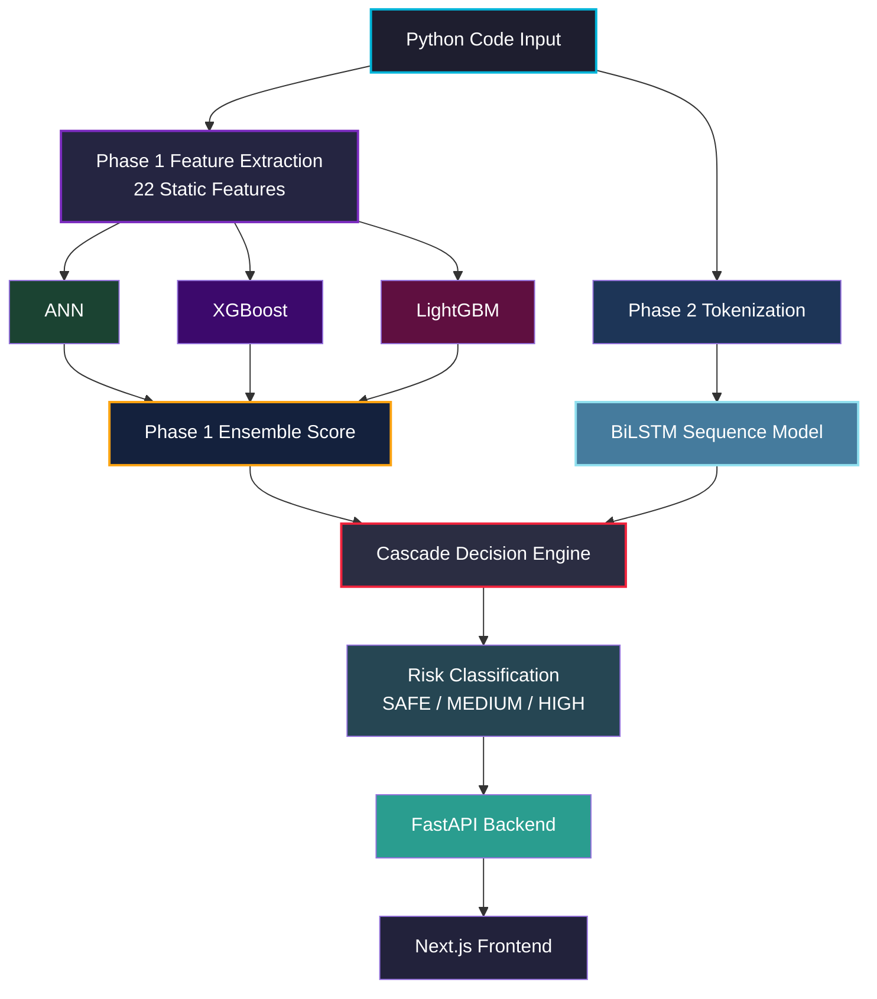

# 🛡️ SecureScope AI

<div align="center">

### AI-Powered Python Vulnerability Scanner

Detect vulnerable Python code using an ensemble of machine learning models trained on real-world security datasets.

<br/>

[](https://securescope-ai.vercel.app)
[](https://adeenaramzan93-securescope-ai-api.hf.space/docs)
[](https://python.org)
[](LICENSE)

</div>

---

## Overview

SecureScope AI scans Python functions for common security vulnerabilities before deployment.

Developers can paste Python code and instantly receive:

* Vulnerability detection
* Confidence scoring
* Risk classification
* Triggered security indicators
* API-based analysis results

### Supported Vulnerabilities

| Vulnerability                | Status |
| ---------------------------- | ------ |
| SQL Injection                | ✅      |
| Hardcoded Secrets            | ✅      |
| Insecure `eval()` / `exec()` | ✅      |
| Path Traversal               | ✅      |
| Command Injection            | ✅      |

---

## Live Demo

| Service  | URL                                                     |
| -------- | ------------------------------------------------------- |
| Frontend | https://securescope-ai.vercel.app                       |
| API Docs | https://adeenaramzan93-securescope-ai-api.hf.space/docs |

---

## Architecture




---

## Model Performance

Evaluated on **3,563 real held-out Python functions** from the PyCode Vul dataset.

### Phase 1 — Ensemble Features

| Metric    | Score     |
| --------- | --------- |
| Accuracy  | **73.4%** |
| Precision | 0.680     |
| Recall    | 0.773     |
| F1 Score  | **0.723** |
| Threshold | 0.39      |

### Phase 2 — Binary BiLSTM Sequence

| Metric    | Score      |
| --------- | ---------- |
| Accuracy  | **95.6%**  |
| Precision | 0.954      |
| Recall    | 0.947      |
| F1 Score  | **0.9505** |
| Threshold | 0.50       |

| Comparison | F1 Score |
| ---------- | -------- |
| Phase 1    | 0.723    |
| Phase 2    | **0.9505** |

> Performance metrics reflect real-world GitHub code rather than synthetic-only benchmarks.

---

## Dataset

| Source                   | Rows        | Description                      |
| ------------------------ | ----------- | -------------------------------- |
| PyCode Vul (IEEE 2025)   | 14,248      | Real GitHub vulnerable functions |
| Synthetic OWASP Examples | 2,750       | Hand-crafted verified samples    |
| **Total Training Data**  | **~17,000** | Combined dataset                 |
| Holdout Test Set         | 3,563       | Never used during training       |

---

## Feature Engineering

SecureScope extracts 22 static-analysis features from each Python function.

### Regex Features

* SQL concatenation patterns
* Hardcoded secret names
* `eval()` / `exec()` detection
* Shell command execution
* Path traversal indicators
* User input references
* Parameterized query detection

### AST Features

* Dangerous function call counts
* Sensitive variable assignments
* Unsafe deserialization usage

### Structural Features

* Nesting depth
* Parameter count
* Exception handling patterns
* Network operations
* Weak cryptography usage

---

## Tech Stack

| Layer                 | Technologies                        |
| --------------------- | ----------------------------------- |
| ML Models             | TensorFlow/Keras, XGBoost, LightGBM, PyTorch BiLSTM |
| Feature Extraction    | Python AST, Regex                   |
| Backend API           | FastAPI, Uvicorn, Pydantic          |
| Frontend              | React, Next.js, Tailwind CSS        |
| Deployment            | Docker, HuggingFace Spaces, Vercel  |
| Hyperparameter Tuning | Keras Tuner                         |

---

## Detection Pipeline

```text id="u5yh6g"
Python Code
    ↓
Feature Extraction
    ↓
Ensemble ML Models
    ↓
Soft Voting
    ↓
Risk Classification
    ↓
REST API Response
    ↓
Frontend Visualization
```

---

## Project Philosophy

This project focuses on end-to-end AI engineering and deployment rather than acting as a production security product.

Key areas demonstrated:

* Ensemble ML system design
* Static analysis pipelines
* Real-world evaluation methodology
* API deployment architecture
* Dockerized ML services
* Frontend/backend AI integration

---

## Known Limitations

* Limited to 5 vulnerability categories
* Phase 1 feature engineering ceiling around ~77% F1 (Phase 2 BiLSTM addresses this)
* BiLSTM covers binary safe/vulnerable classification only (no per-vulnerability labels yet)
* HuggingFace free tier cold starts may delay first response

---

## Roadmap

* [x] Phase 1 — Ensemble ML + Feature Engineering
* [x] Phase 2 — BiLSTM Token Sequence Analysis
* [ ] Phase 3 — RAG + LLM Vulnerability Explanations
* [ ] Phase 4 — GitHub PR Review Bot
* [ ] Phase 5 — Multi-language Support

---

## Run Locally

### Clone Repository

```bash id="7j4m9n"
git clone https://github.com/AdeenaRamzan/securescope-ai

cd securescope-ai
```

### Backend Setup

```bash id="r4y0lb"
cd backend

python -m venv venv

# Windows
venv\Scripts\activate

# Linux / macOS
source venv/bin/activate

pip install -r requirements.txt

uvicorn src.api.main:app --reload --port 8000
```

### Frontend Setup

```bash id="m9tnul"
cd frontend

npm install

npm run dev
```

---

## Docker Deployment

```bash id="7wdrg8"
docker build -t securescope-ai .

docker run -p 8000:8000 securescope-ai
```

---

## Citation

```bibtex id="fcjlwm"
@dataset{pycodevul2025,
  title={PyCode Vul: A Python-based Software Vulnerability Dataset},
  author={Karim, Tasmin and Akter, Mst Shapna and Cuzzocrea, Alfredo},
  year={2025},
  publisher={IEEE}
}
```

---

## Author

**Adeena Ramzan**
AI Engineering Portfolio Project — 2026

Focused on:

* AI Security Engineering
* Machine Learning Systems
* Backend AI Infrastructure
* Full-Stack AI Deployment

---
