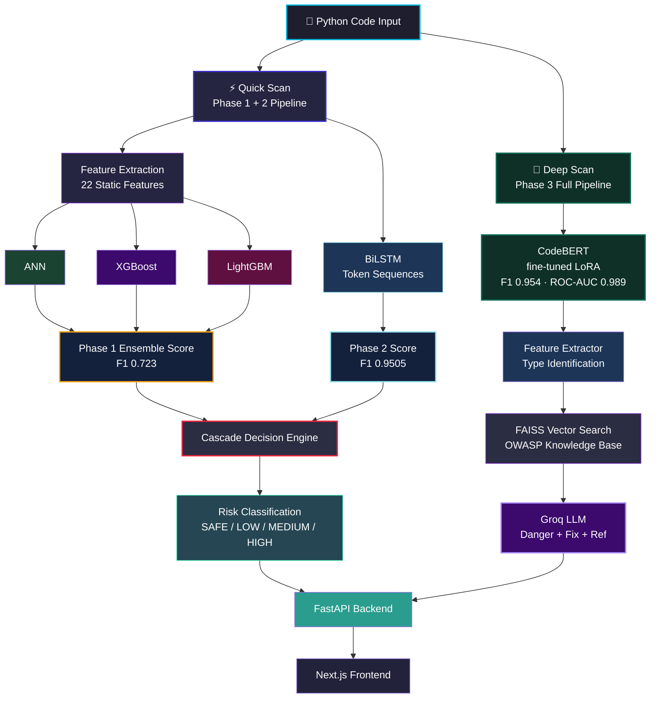

# 🛡️ SecureScope AI

<div align="center">

### AI-Powered Python Vulnerability Scanner

Detect, classify, and explain vulnerable Python code using a cascade of machine learning models trained on real-world security datasets.

<br/>

[](https://securescope-ai.vercel.app)
[](https://adeenaramzan93-securescope-ai-api.hf.space/docs)
[](https://python.org)
[](LICENSE)

</div>

---

## Overview

SecureScope AI scans Python functions for common security vulnerabilities before deployment.

Developers can paste Python code and instantly receive:

* Vulnerability detection with confidence scoring
* Risk classification (HIGH / MEDIUM / LOW / SAFE)
* Triggered security feature indicators
* AI-generated danger explanation and fix suggestion
* OWASP-referenced remediation guidance

### Supported Vulnerabilities

| Vulnerability                | Status |
| ---------------------------- | ------ |
| SQL Injection                | ✅      |
| Hardcoded Secrets            | ✅      |
| Insecure `eval()` / `exec()` | ✅      |
| Path Traversal               | ✅      |
| Command Injection            | ✅      |

---

## Live Demo

| Service      | URL                                                     |
| ------------ | ------------------------------------------------------- |
| Frontend     | https://securescope-ai.vercel.app                       |
| API Docs     | https://adeenaramzan93-securescope-ai-api.hf.space/docs |

---

## Architecture



---

## Model Performance

Evaluated on **3,563 real held-out Python functions** from the PyCode Vul benchmark. Same holdout set across all phases — never used during training.

### Phase 1 — Ensemble ML

| Metric    | Score      |
| --------- | ---------- |
| Accuracy  | **73.4%**  |
| Precision | 0.680      |
| Recall    | 0.773      |
| F1 Score  | **0.723**  |
| Threshold | 0.39       |

### Phase 2 — Bidirectional LSTM

| Metric    | Score      |
| --------- | ---------- |
| Accuracy  | **95.6%**  |
| Precision | 0.954      |
| Recall    | 0.947      |
| F1 Score  | **0.9505** |
| Threshold | 0.50       |

### Phase 3 — CodeBERT (fine-tuned with LoRA)

| Metric    | Score      |
| --------- | ---------- |
| Accuracy  | **95.9%**  |
| Precision | 0.9625     |
| Recall    | 0.9457     |
| F1 Score  | **0.9540** |
| ROC-AUC   | **0.9889** |
| Threshold | 0.23       |

### Progression Across Phases

| Phase   | Model                    | F1 Score   | Improvement |
| ------- | ------------------------ | ---------- | ----------- |
| Phase 1 | ANN + XGBoost + LightGBM | 0.723      | baseline    |
| Phase 2 | Bidirectional LSTM       | 0.9505     | +31.5%      |
| Phase 3 | CodeBERT (LoRA)          | **0.9540** | +32.0%      |

> All metrics evaluated on the same 3,563 held-out real-world GitHub functions from PyCode Vul. No synthetic data in evaluation.

---

## Dual Pipeline Design

SecureScope ships two pipelines for two different use cases.

| | Quick Scan | Deep Scan |
|---|---|---|
| **Use case** | Fast automated scanning | On-demand thorough analysis |
| **Models** | ANN + XGB + LGB + BiLSTM | CodeBERT + FAISS RAG + LLM |
| **Speed** | ~200ms | ~3-5 seconds |
| **Output** | Risk score + features fired | Risk score + explanation + fix |
| **Endpoint** | `POST /scan` | `POST /scan/deep` |

---

## Dataset

| Source                   | Rows        | Description                         |
| ------------------------ | ----------- | ----------------------------------- |
| PyCode Vul (IEEE 2025)   | 14,248      | Real GitHub vulnerable functions     |
| Synthetic OWASP Examples | 2,750       | Hand-crafted verified samples        |
| **Total Training Data**  | **~17,000** | Combined dataset                     |
| Holdout Test Set         | 3,563       | Never used during training           |

Real GitHub projects in training data: Django, Flask, Apache Airflow, SQLMap, MLflow.

---

## Feature Engineering (Phase 1)

SecureScope extracts 22 static-analysis features from each Python function.

### Regex Features
* SQL concatenation patterns
* Hardcoded secret names
* `eval()` / `exec()` detection
* Shell command execution
* Path traversal indicators
* User input references
* Parameterized query detection

### AST Features
* Dangerous function call counts
* Sensitive variable assignments
* Unsafe deserialization usage

### Structural Features
* Maximum nesting depth
* Parameter count
* Exception handling patterns
* Network operation detection
* Weak cryptography usage

---

## Phase 3 RAG Pipeline

Deep Scan runs a full Retrieval Augmented Generation pipeline.

```
Vulnerable code detected by CodeBERT
         ↓
Phase 1 feature extractor identifies vulnerability type
         ↓
FAISS vector search over 10 OWASP cheat sheets
         ↓
Top 3 relevant chunks retrieved
         ↓
Groq LLM generates structured output:
  DANGER: what an attacker can do
  FIX:    corrected Python code
  REF:    OWASP source reference
```

OWASP sources indexed: SQL Injection Prevention, Query Parameterization, OS Command Injection Defense, Secrets Management, File Upload, Input Validation, Django Security, Injection Prevention, Deserialization, Secure Code Review.

---

## Tech Stack

| Layer              | Technologies                                          |
| ------------------ | ----------------------------------------------------- |
| ML Models          | TensorFlow/Keras, XGBoost, LightGBM, PyTorch BiLSTM  |
| Transformer        | CodeBERT (microsoft/codebert-base) + LoRA via peft    |
| Feature Extraction | Python AST, Regex                                     |
| RAG                | FAISS, sentence-transformers, OWASP cheat sheets      |
| LLM                | Groq API (Llama3-8B)                                  |
| Backend API        | FastAPI, Uvicorn, Pydantic                            |
| Frontend           | React, Next.js, Tailwind CSS                          |
| Deployment         | Docker, HuggingFace Spaces, Vercel                    |

---

## Project Philosophy

This project focuses on end-to-end AI engineering rather than acting as a production security product.

Key areas demonstrated:

* Multi-phase model progression with honest benchmarking
* Ensemble ML system design
* Sequential deep learning on code token streams
* Transformer fine-tuning with LoRA on real vulnerability data
* RAG pipeline over domain-specific knowledge base
* Dual-pipeline API architecture (speed vs accuracy)
* Dockerized ML services with production deployment

---

## Known Limitations

* Limited to 5 vulnerability categories
* Type classification is rule-based via feature extractor — no ML-based type classifier due to insufficient labeled type data in available datasets
* CodeBERT threshold of 0.23 reflects model calibration on this dataset distribution
* HuggingFace free tier cold starts may delay first API response by 30-60 seconds

---

## Roadmap

* [x] Phase 1 — Ensemble ML + Feature Engineering (F1 0.723)
* [x] Phase 2 — BiLSTM Token Sequence Analysis (F1 0.9505)
* [x] Phase 3 — CodeBERT fine-tuning + RAG explanation engine (F1 0.954)
* [ ] Phase 4 — ReAct Agent GitHub PR Review Bot
* [ ] Phase 5 — Multi-language Support

---

## Run Locally

### Clone Repository

```bash
git clone https://github.com/AdeenaRamzan/securescope-ai
cd securescope-ai
```

### Backend Setup

```bash
cd backend

python -m venv venv

# Windows
venv\Scripts\activate

# Linux / macOS
source venv/bin/activate

pip install -r requirements.txt

uvicorn src.api.main:app --reload --port 8000
```

### Frontend Setup

```bash
cd frontend
npm install
npm run dev
```

### Environment Variables

Create `backend/.env`:

```
GROQ_API_KEY=your_groq_api_key_here
```

Create `frontend/.env.local`:

```
NEXT_PUBLIC_API_BASE_URL=http://localhost:8000
```

---

## Docker Deployment

```bash
docker build -t securescope-ai .
docker run -p 8000:8000 -e GROQ_API_KEY=your_key securescope-ai
```

---

## Citation

```bibtex
@dataset{pycodevul2025,
  title={PyCode Vul: A Python-based Software Vulnerability Dataset},
  author={Karim, Tasmin and Akter, Mst Shapna and Cuzzocrea, Alfredo},
  year={2025},
  publisher={IEEE}
}
```

---

## Author

**Adeena Ramzan**
AI Engineering Portfolio Project — 2026

Focused on:
* AI Security Engineering
* Machine Learning Systems
* Backend AI Infrastructure
* Full-Stack AI Deployment