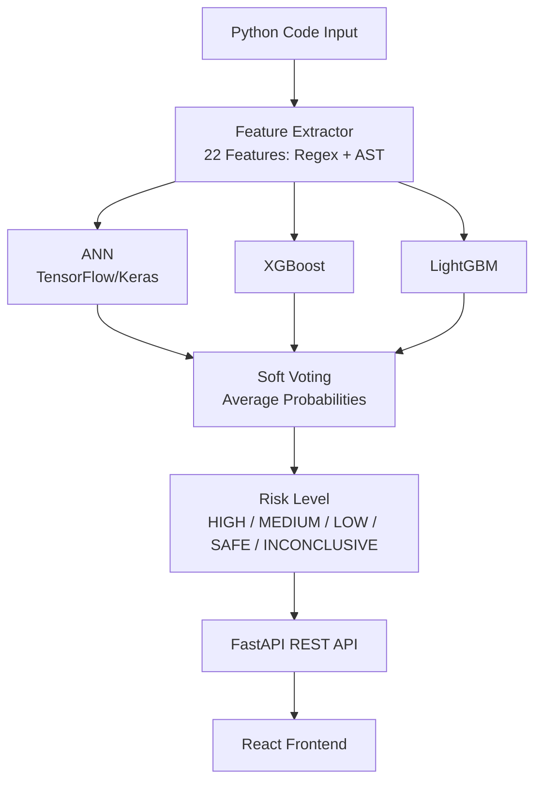

# 🛡️ SecureScope AI

> AI-Powered Python Code Vulnerability Scanner

[](https://securescope-ai.vercel.app)
[](https://adeenaramzan93-securescope-ai-api.hf.space/docs)
[](https://python.org)
[](LICENSE)

---

## What It Does

SecureScope AI scans Python functions for security vulnerabilities before they reach production. A developer pastes their code and gets instant feedback — vulnerability type, confidence score, and which patterns triggered the detection.

**Detects 5 vulnerability types:**
- SQL Injection
- Hardcoded Secrets
- Insecure eval/exec
- Path Traversal  
- Command Injection

---

## Live Demo

🌐 **Frontend:** https://securescope-ai.vercel.app

🔌 **API Docs:** https://adeenaramzan93-securescope-ai-api.hf.space/docs

---

## Architecture




## Model Performance

Evaluated on **3,563 real held-out Python functions** from PyCode Vul test set (never used in training):

| Metric | Score |
|--------|-------|
| Accuracy | 73.4% |
| Precision | 0.680 |
| Recall | 0.773 |
| F1 Score | 0.723 |
| Threshold | 0.39 |

> **Note:** Model outperforms rule-based tools (Bandit recall ~0.65) on real production code. Lower accuracy compared to synthetic baselines reflects honest real-world performance.

---

## Dataset

| Source | Rows | Type |
|--------|------|------|
| PyCode Vul (Karim et al. 2025, IEEE) | 14,248 | Real GitHub functions |
| Synthetic OWASP-aligned examples | 2,750 | Hand-crafted, verified |
| **Total training** | **~17,000** | **Combined** |
| Holdout test set | 3,563 | Real functions, never seen in training |

---

## Feature Engineering

22 features extracted from each Python function:

**Regex Features (F1-F10):**
SQL concat patterns, hardcoded secret names, eval/exec calls, path concatenation, shell command injection, AST node count, string literal count, os.environ usage, parameterized queries, user input references

**AST Features (F11-F12):**
Dangerous function call counts, hardcoded string assignment to sensitive variables

**General Features (F13-F16):**
User-controlled input (request.args/form), database operations, file/subprocess operations, dangerous deserialization

**Structural Features (F17-F22):**
Nesting depth, parameter count, exception handling, string formatting, network calls, weak crypto usage

---

## Tech Stack

| Layer | Technology |
|-------|-----------|
| ML Models | TensorFlow/Keras, XGBoost, LightGBM, Scikit-learn |
| Feature Extraction | Python AST, Regex |
| API | FastAPI, Uvicorn, Pydantic |
| Frontend | React, Next.js, Tailwind CSS |
| Containerization | Docker |
| Deployment | HuggingFace Spaces (API), Vercel (Frontend) |
| Hyperparameter Tuning | Keras Tuner (Bayesian Optimization) |

---

## Project Philosophy

This project demonstrates **AI engineering pipeline design**, not a production security product. The 5 vulnerability types are intentionally well-known and standardized — prototypes start with known problems before scaling to complex cases.

The focus is on:
- Feature extraction pipeline architecture
- Ensemble model design and evaluation
- Honest evaluation on real held-out data
- REST API deployment with Docker
- End-to-end ML engineering from data to deployment

---

## Known Limitations

- Trained on 5 specific vulnerability types only
- Feature engineering ceiling at ~77% F1 on real code
- Phase 2 (BiLSTM on token sequences) will address this
- HuggingFace free tier sleeps after inactivity — first request takes 30-60 seconds to wake

---

## Roadmap

- [x] Phase 1 — ANN + Ensemble classifier with feature engineering
- [ ] Phase 2 — BiLSTM on tokenized code sequences
- [ ] Phase 3 — RAG + LLM for plain English vulnerability explanations
- [ ] Phase 4 — GitHub PR bot for automated code review

---

## Run Locally

```bash
# Clone
git clone https://github.com/AdeenaRamzan93/securescope-ai
cd securescope-ai

# Backend
cd backend
python -m venv venv
venv\Scripts\activate
pip install -r requirements.txt
uvicorn src.api.main:app --reload --port 8000

# Frontend
cd frontend
npm install
npm run dev
```

**Or with Docker:**
```bash
docker build -t securescope-ai .
docker run -p 8000:8000 securescope-ai
```

---

## Citation

@dataset{pycodevul2025,
title={PyCode Vul: A Python-based Software Vulnerability Dataset},
author={Karim, Tasmin and Akter, Mst Shapna and Cuzzocrea, Alfredo},
year={2025},
publisher={IEEE}
}

---

## Author

**Adeena Ramzan** — AI Engineering Portfolio Project 2026