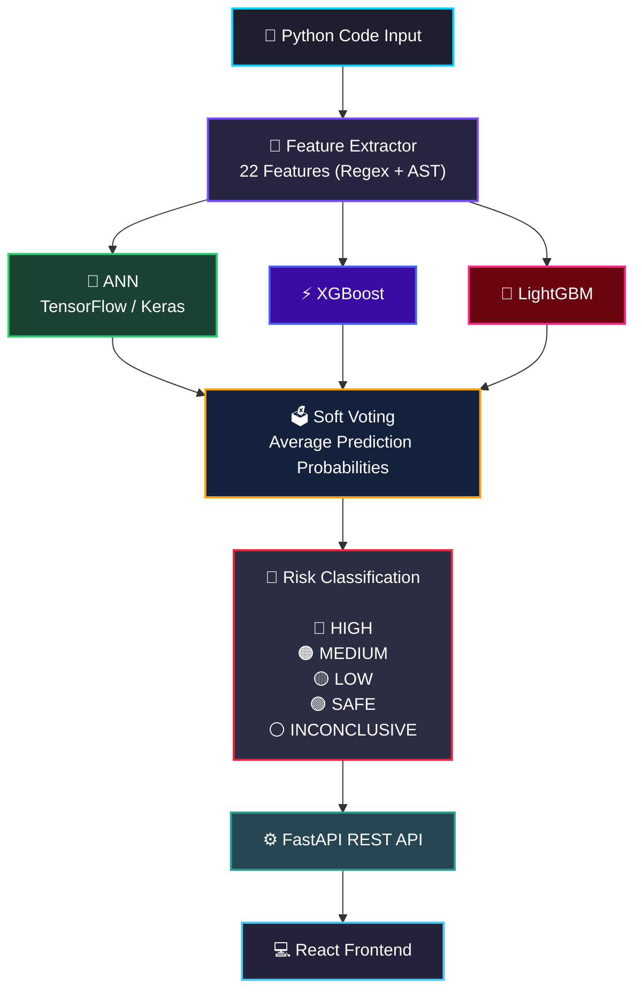

# 🛡️ SecureScope AI

<div align="center">

### 🚀 AI-Powered Python Vulnerability Detection Platform

Detect insecure Python code using an ensemble of Machine Learning models trained on real-world vulnerability datasets.

<br/>

[](https://securescope-ai.vercel.app)
[](https://adeenaramzan93-securescope-ai-api.hf.space/docs)
[](https://python.org)
[](LICENSE)

</div>

---

# ✨ Overview

SecureScope AI scans Python functions for security vulnerabilities **before deployment** using a hybrid AI pipeline combining:

* 🧠 Deep Learning
* ⚡ Gradient Boosting
* 🌲 Ensemble ML
* 🔍 Static Code Analysis
* 🐍 Python AST Parsing

Developers paste Python code and instantly receive:

✅ Vulnerability detection
✅ Confidence scoring
✅ Triggered security patterns
✅ Risk classification
✅ API-based analysis results

---

# 🎯 Supported Vulnerabilities

| Vulnerability                   | Detection |
| ------------------------------- | --------- |
| 💉 SQL Injection                | ✅         |
| 🔑 Hardcoded Secrets            | ✅         |
| ⚠️ Insecure `eval()` / `exec()` | ✅         |
| 📂 Path Traversal               | ✅         |
| 💻 Command Injection            | ✅         |

---

# 🌐 Live Demo

| Service             | Link                                                    |
| ------------------- | ------------------------------------------------------- |
| 🚀 Frontend         | https://securescope-ai.vercel.app                       |
| ⚡ API Documentation | https://adeenaramzan93-securescope-ai-api.hf.space/docs |

---

# 🏗️ System Architecture



---

# 📊 Model Performance

Evaluated on **3,563 real-world held-out Python functions** from the **PyCode Vul** dataset.

| Metric             | Score     |
| ------------------ | --------- |
| 🎯 Accuracy        | **73.4%** |
| Precision          | 0.680     |
| Recall             | 0.773     |
| F1 Score           | **0.723** |
| Decision Threshold | 0.39      |

> ⚠️ Unlike synthetic benchmark papers, these metrics reflect **real-world GitHub code performance**.

---

# 🧪 Dataset Composition

| Source                  | Samples     | Description                      |
| ----------------------- | ----------- | -------------------------------- |
| PyCode Vul Dataset      | 14,248      | Real GitHub vulnerable functions |
| OWASP Synthetic Samples | 2,750       | Hand-crafted verified examples   |
| **Training Total**      | **~17,000** | Combined dataset                 |
| Holdout Test Set        | 3,563       | Never seen during training       |

---

# ⚙️ Feature Engineering Pipeline

SecureScope extracts **22 static-analysis features** from each Python function.

## 🔍 Regex Features

* SQL concatenation patterns
* Hardcoded secret detection
* `eval()` / `exec()` calls
* Shell command injection
* Path traversal indicators
* User input references
* Parameterized query usage

## 🌳 AST Features

* Dangerous function call frequency
* Sensitive variable assignments
* Unsafe deserialization patterns

## 🧠 Structural Features

* Nesting depth
* Exception handling
* String formatting style
* Network operations
* Weak cryptography usage

---

# 🧰 Tech Stack

| Layer                 | Technologies                        |
| --------------------- | ----------------------------------- |
| 🧠 ML Models          | TensorFlow/Keras, XGBoost, LightGBM |
| 🔍 Feature Extraction | Python AST, Regex                   |
| ⚡ API Backend         | FastAPI, Uvicorn, Pydantic          |
| 💻 Frontend           | React, Next.js, Tailwind CSS        |
| 📦 Deployment         | Docker, HuggingFace Spaces, Vercel  |
| 📈 Optimization       | Keras Tuner (Bayesian Optimization) |

---

# 🚀 Detection Pipeline

```text
Python Code
    ↓
Feature Extraction
    ↓
Ensemble ML Models
    ↓
Soft Voting
    ↓
Risk Classification
    ↓
REST API Response
    ↓
Frontend Visualization
```

---

# 🧭 Project Philosophy

This project focuses on **end-to-end AI engineering architecture**, not merely vulnerability detection.

The objective is to demonstrate:

* 🧠 Ensemble ML system design
* 🔍 Static analysis pipelines
* 📊 Honest evaluation methodology
* ⚡ API deployment architecture
* 🐳 Dockerized ML systems
* 🌐 Production-style frontend/backend integration

---

# ⚠️ Known Limitations

* Limited to 5 vulnerability categories
* Feature-engineering ceiling around ~77% F1
* No sequence-based semantic understanding yet
* HuggingFace free tier cold starts may cause initial delay

---

# 🛣️ Roadmap

* [x] Phase 1 — Ensemble ML + Feature Engineering
* [ ] Phase 2 — BiLSTM Token Sequence Analysis
* [ ] Phase 3 — RAG + LLM Vulnerability Explanations
* [ ] Phase 4 — GitHub PR Review Bot
* [ ] Phase 5 — Multi-language Support

---

# 🖥️ Run Locally

## Clone Repository

```bash
git clone https://github.com/AdeenaRamzan93/securescope-ai
cd securescope-ai
```

## Backend Setup

```bash
cd backend

python -m venv venv

# Windows
venv\Scripts\activate

# Linux / macOS
source venv/bin/activate

pip install -r requirements.txt

uvicorn src.api.main:app --reload --port 8000
```

## Frontend Setup

```bash
cd frontend

npm install
npm run dev
```

---

# 🐳 Docker Deployment

```bash
docker build -t securescope-ai .

docker run -p 8000:8000 securescope-ai
```

---

# 📚 Citation

```bibtex
@dataset{pycodevul2025,
  title={PyCode Vul: A Python-based Software Vulnerability Dataset},
  author={Karim, Tasmin and Akter, Mst Shapna and Cuzzocrea, Alfredo},
  year={2025},
  publisher={IEEE}
}
```

---

# 👩‍💻 Author

## Adeena Ramzan

AI Engineering Portfolio Project — 2026

Focused on:

* AI Security Engineering
* Machine Learning Systems
* Backend AI Infrastructure
* Full-Stack AI Deployment

---
