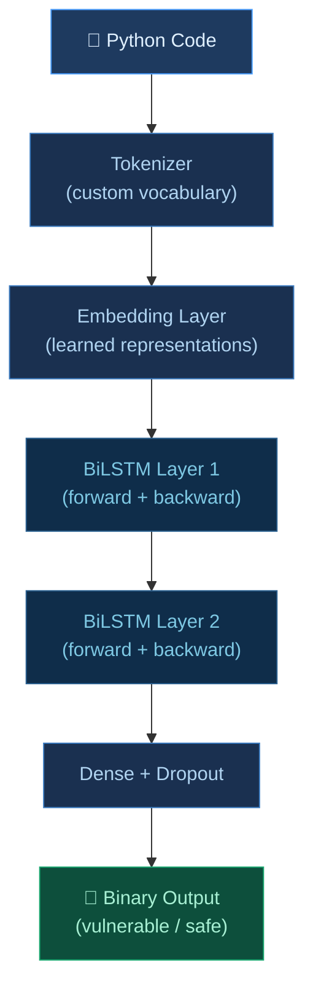
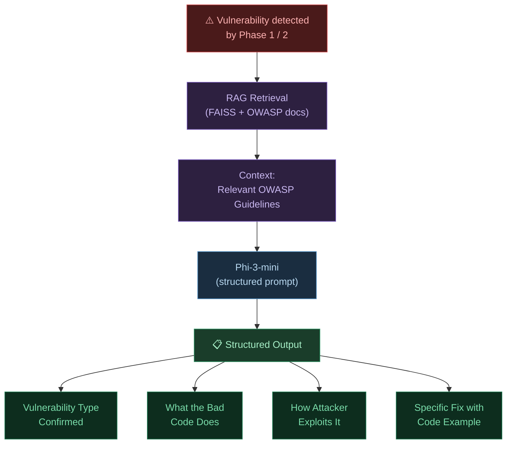
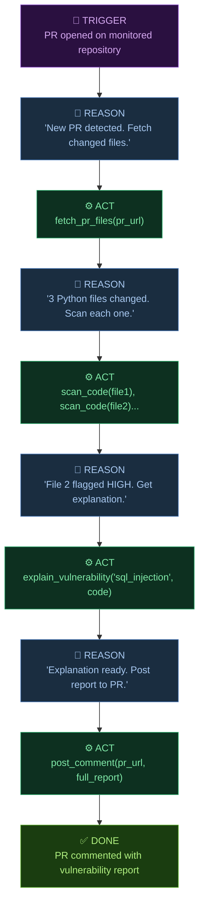
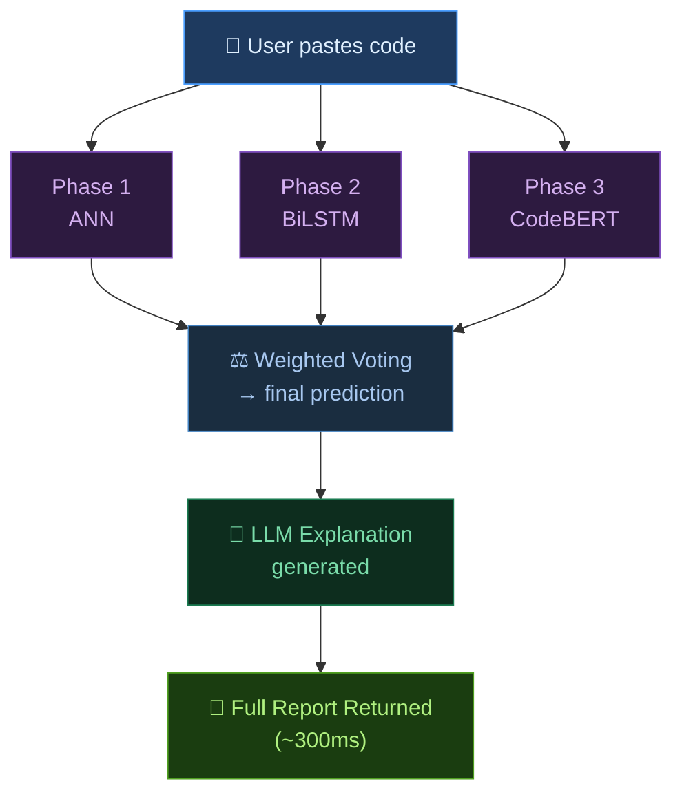
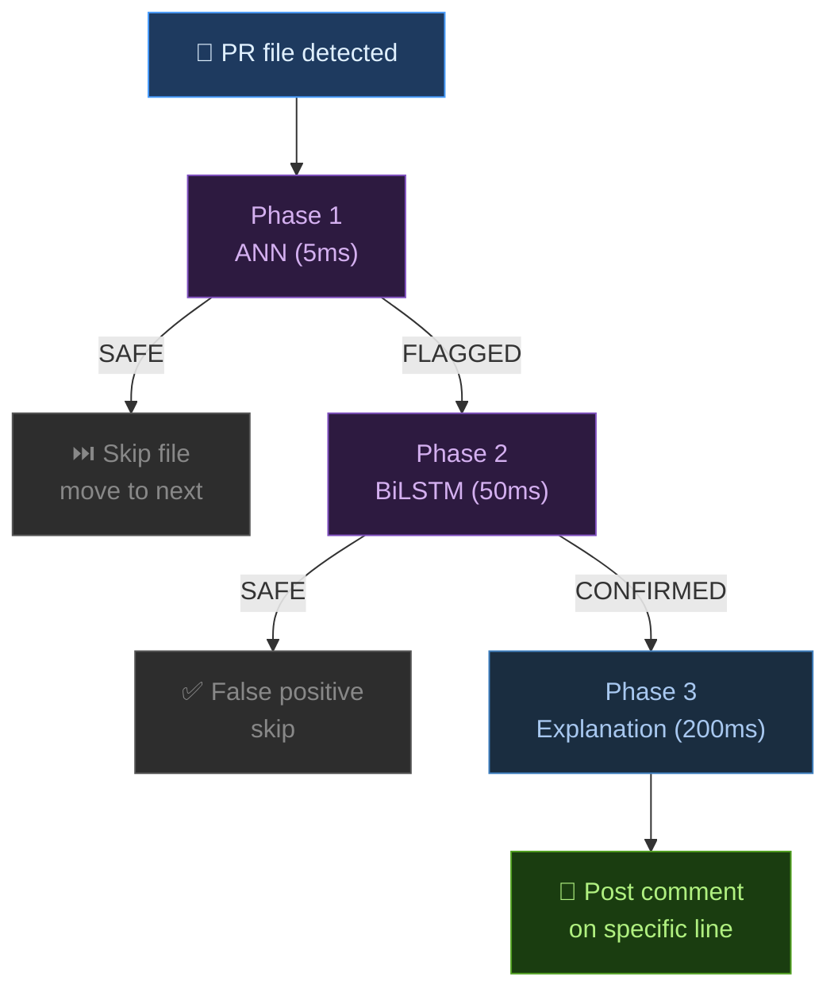

# SecureScope AI — Complete Architecture Document
## Updated: June 2026

---

## Project Philosophy

SecureScope AI is not just a vulnerability scanner.
It is a 4-phase AI security agent that monitors,
detects, explains, and reports vulnerabilities
autonomously.

Each phase builds on the previous one.
Each phase was motivated by the limitations
of the previous phase.

---

## The 4-Phase Pipeline

### Phase 1 — Ensemble ML Gate (COMPLETE ✅)
**Purpose:** Fast baseline classifier for obvious patterns

**Models:**
- ANN (TensorFlow/Keras) — 22-feature neural network
- XGBoost — gradient boosting on tabular features
- LightGBM — fast gradient boosting

**Feature Extractor:** 22 features (Regex + AST)
- F1-F5:   Vulnerability-specific regex patterns
- F6-F10:  Structural code signals
- F11-F12: AST-based dangerous call detection
- F13-F16: General code operation signals
- F17-F22: Complexity and structural features

**Results on 3,563 real held-out functions:**
- Accuracy:  73.4%
- Precision: 0.680
- Recall:    0.773
- F1:        0.723
- Threshold: 0.39

**Known Limitation:**
Feature engineering ceiling at ~77% recall.
Generic complexity features dominate over
vulnerability-specific signals.
Phase 2 addresses this directly.

**Deployed at:**
- API: https://adeenaramzan93-securescope-ai-api.hf.space
- UI:  https://securescope-ai.vercel.app

---

### Phase 2 — BiLSTM Sequence Analyzer (IN PROGRESS 🔄)
**Purpose:** Learn sequential code patterns without
hand-crafted features

**Why BiLSTM over ANN:**
- ANN sees:    22 hand-crafted numbers
- BiLSTM sees: actual token sequence
- "def", "get_user", "(", "user_id", ...
- Left-to-right AND right-to-left context
- Patterns ANN cannot capture

**Architecture:**



**Training:** Google Colab GPU (T4)
**Dataset:** Same PyCode Vul + synthetic combined
**Target:** Recall > 0.82

---

### Phase 3 — RAG + LLM Explanation Engine (PLANNED 📋)
**Purpose:** Explain vulnerabilities in plain English
with actionable fix suggestions

**Architecture:**



**Template-constrained output:**
```
VULNERABILITY: {type}
EXPLANATION:   {what_bad_code_does}
RISK:          {attack_scenario}
FIX:           {code_fix}
```

---

### Phase 4 — Autonomous GitHub PR Agent (PLANNED 📋)
**Purpose:** Monitor pull requests and auto-review
code changes without human intervention

**This is a ReAct-style agent with 4 tools:**

```python
Tool 1: scan_code(code)
        → calls ensemble (Phase 1 + 2)
        → returns risk level + confidence

Tool 2: fetch_pr_files(pr_url)
        → calls GitHub API
        → returns changed files + diffs

Tool 3: explain_vulnerability(type, code)
        → calls RAG + Phi-3-mini (Phase 3)
        → returns structured explanation + fix

Tool 4: post_comment(pr_url, report)
        → calls GitHub API
        → posts formatted vulnerability report
```

**Agent reasoning loop (ReAct pattern):**



---

## Two Scanning Modes

### Mode 1 — On-Demand UI Scan
**Used by:** Developer pasting code into web UI
**Priority:** Maximum accuracy
**All models run in parallel:**



### Mode 2 — GitHub PR Bot Scan
**Used by:** Automated agent scanning many files
**Priority:** Speed + practical throughput
**Cascade architecture:**



**Why cascade for PR bot:**
Scanning 100 files × 300ms = 30 seconds (too slow)
Scanning 100 files × 5ms ANN gate = 0.5 seconds
Only flagged files (maybe 10%) go deeper
Total: ~3 seconds for 100 files

---

## Technology Stack

| Layer | Technology | Purpose |
|-------|-----------|---------|
| ML Models | TensorFlow, XGBoost, LightGBM | Phase 1 ensemble |
| Sequence Model | PyTorch BiLSTM | Phase 2 |
| Transformer | CodeBERT (Microsoft) | Phase 3 |
| RAG | FAISS + sentence-transformers | Phase 3 retrieval |
| LLM | Phi-3-mini | Phase 3 explanation |
| Agent Framework | Custom ReAct | Phase 4 |
| API | FastAPI + Pydantic | REST endpoints |
| Frontend | React + Next.js | Web UI |
| Container | Docker | Deployment |
| Deployment | HuggingFace Spaces + Vercel | Production |
| Version Control | Git + GitHub | Source code |

---

## Model Performance Progression

| Phase | Model | Recall | F1 | Notes |
|-------|-------|--------|-----|-------|
| 1 | ANN Ensemble | 0.773 | 0.722 | Real holdout |
| 2 | BiLSTM | TBD | TBD | Target >0.82 |
| 3 | CodeBERT | TBD | TBD | Target >0.87 |

---

## Dataset

| Source | Rows | Type |
|--------|------|------|
| PyCode Vul (IEEE 2025) | 14,248 | Real GitHub functions |
| Synthetic OWASP-aligned | 2,750 | Hand-crafted verified |
| Total training | ~17,000 | Combined |
| Holdout test | 3,563 | Real, never seen in training |

---

## Known Limitations and Honest Notes

Phase 1:
Feature engineering ceiling at ~77% recall
Generic complexity features dominate importance
Cannot detect obfuscated patterns:
getattr(os, 'sys'+'tem')(cmd) → not 

Phase 2 (planned):
BiLSTM still less accurate than transformers
Included for learning progression
CodeBERT replacement planned for Phase 3

Dataset:
PyCode Vul labels from automated tools
Some noise in vulnerable/safe classification
Documented honestly in evaluation

General:
Covers 5 vulnerability types only
Not a replacement for production security tools
Demonstrates pipeline engineering methodology

---

## Interview Talking Points

**"Why ANN first if BiLSTM is better?"**
ANN establishes the baseline and identifies
the feature ceiling. Without building it,
we would not understand WHY BiLSTM is needed.
The progression is the learning story.

**"Why BiLSTM if transformers are better?"**
BiLSTM teaches sequence modeling fundamentals.
CodeBERT is the production model in Phase 3.
BiLSTM is the bridge between feature engineering
and pre-trained representations.

**"Is this production ready?"**
Phase 1 is deployed and functional.
It demonstrates pipeline engineering methodology,
not a claim to replace tools like Semgrep or Bandit.
The honest evaluation on real data shows 77% recall
which already exceeds rule-based tools.

**"What makes this an agent?"**
Phase 4 implements a ReAct-style agent with
4 tools: scan, fetch, explain, post.
It operates autonomously on GitHub PRs without
human intervention. The reasoning loop follows
the standard Observe → Reason → Act pattern.